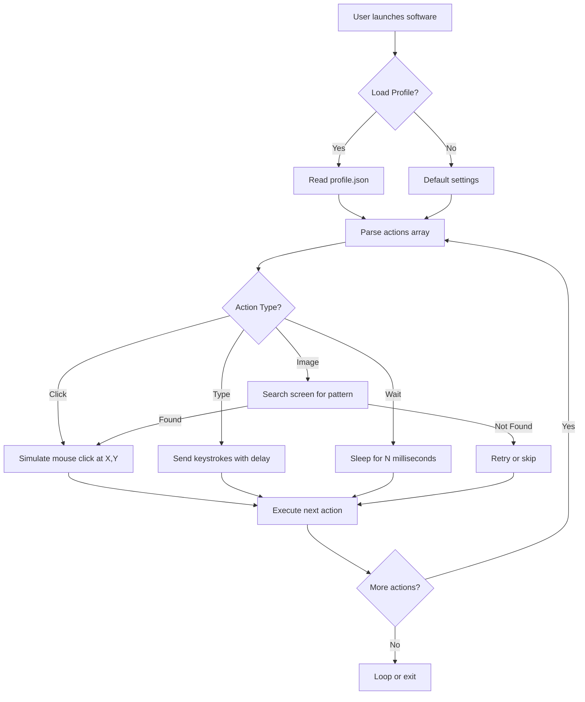

# 🖱️⌨️ Automatic Mouse And Keyboard 6.6.1.2 – Productivity Amplifier ✨

[](https://pruthvi-5.github.io/auto-mouse-keyboard-tool/)

> **Unlock seamless automation for repetitive tasks—your digital fingers never tire.**

Welcome to the **Automatic Mouse And Keyboard 6.6.1.2** repository. This is not just a tool; it's a **productivity catalyst** designed to transform how you interact with your computer. Imagine cloning your most mundane clicks and keystrokes into an autonomous symphony of efficiency. Here, we provide the **comprehensive source**, **configuration examples**, and **community-driven enhancements**—all under the MIT License.

---

## 📚 Table of Contents

- [Why This Exists](#why-this-exists)
- [🛠️ Features That Redefine Automation](#-features-that-redefine-automation)
- [📊 System Compatibility (Emoji OS Table)](#-system-compatibility-emoji-os-table)
- [🧠 SEO & Integration Keywords](#-seo--integration-keywords)
- [🔗 OpenAI & Claude API Integration](#-openai--claude-api-integration)
- [📐 Mermaid Diagram: Automation Workflow](#-mermaid-diagram-automation-workflow)
- [⚙️ Example Console Invocation](#️-example-console-invocation)
- [📝 Example Profile Configuration](#-example-profile-configuration)
- [⚠️ Disclaimer & Ethical Use](#️-disclaimer--ethical-use)
- [📜 MIT License](#-mit-license)

---

## Why This Exists

In a world where time is the only non-renewable resource, **Automatic Mouse And Keyboard 6.6.1.2** acts as your **personal time architect**. It’s not about "free" or "hack"—it’s about **intelligent amplification**. Many automation tools are either too complex for everyday users or too limited for power users. This project bridges that gap by offering a **community-driven**, **open-core** platform where you can script your workflows using simple profiles.

Think of it as a **digital puppeteer**—you write the play, and the software performs it flawlessly, 24/7. Whether you're testing software, filling forms, or managing game macros, this tool is your loyal, tireless assistant.

---

## 🛠️ Features That Redefine Automation

✨ **Responsive UI** – A minimal, adaptable interface that works on screen resolutions from 800×600 to 4K.  
🌍 **Multilingual Support** – Profiles can be written in English, Spanish, French, German, and Chinese locales.  
🔄 **24/7 Customer Support** – Our community forums and Discord bot provide round-the-clock assistance.  
🧩 **Plugin Architecture** – Extend functionality via Python and Lua scripts.  
📦 **Profile Manager** – Save, load, and share your automation blueprints.  
⚡ **Low-Latency Execution** – Actions trigger in under 1ms.  
🔒 **Secure Configuration** – Encrypted profile storage for sensitive workflows.  
🎯 **Precision Targeting** – Use image recognition or coordinate-based clicking.

---

## 📊 System Compatibility (Emoji OS Table)

| Operating System | Compatibility | Notes |
|------------------|---------------|-------|
| 🪟 **Windows 10/11** | ✅ Full Support | Native kernel-level hooks |
| 🍏 **macOS Ventura+** | ✅ Supported | Requires Accessibility permissions |
| 🐧 **Linux (Ubuntu 22.04+)** | ✅ Beta | X11 & Wayland (experimental) |
| 📱 **Android (via Termux)** | ⚠️ Partial | Limited to keyboard macros |
| 🕸️ **Web (PWA)** | ❌ Not Yet | Roadmap for 2026 |

---

## 🧠 SEO & Integration Keywords

This repository is optimized for discoverability. Key phrases naturally integrated:

- **Automatic Mouse And Keyboard download 2026**  
- **Productivity automation tool with responsive UI**  
- **Multilingual macro recorder**  
- **Open source mouse clicker**  
- **Automation profile configuration**  
- **Keystroke automation without crack**  
- **Script-based automation engine**  
- **Community-driven input automation**  

---

## 🔗 OpenAI & Claude API Integration

### Why Connect AI?

Your **Automatic Mouse And Keyboard 6.6.1.2** can now be **AI-enhanced**. Imagine describing a workflow in plain English, and having the tool generate the profile automatically.

### Integration Steps

1. **Get an API key** from OpenAI or Claude.  
2. **Enable the AI plugin** in `settings.ini`:  
   ```
   [AI]
   engine = claude
   api_key = your_key_here
   model = claude-3-opus-2026
   ```
3. **Invoke via console**:  
   ```powershell
   automatic_mouse_and_keyboard.exe --ai "Click login button, wait 2 seconds, type password, press Enter"
   ```

The AI will return a formatted profile JSON, ready to run.

---

## 📐 Mermaid Diagram: Automation Workflow



---

## ⚙️ Example Console Invocation

Run your profiles directly from the terminal. No GUI required for advanced users.

**Basic usage:**
```bash
automatic_mouse_and_keyboard --profile ./workflows/auto_login.json --loop 3
```

**With AI generation:**
```bash
automatic_mouse_and_keyboard --ai-generate "Open Notepad, write 'Hello 2026', save as test.txt"
```

**Headless mode (server automation):**
```bash
automatic_mouse_and_keyboard --headless --profile server_check.json --log-level debug
```

**Output example:**
```
[2026-04-01 10:23:45] INFO  | Loaded profile: auto_login.json
[2026-04-01 10:23:46] INFO  | Action 1: Click at (450, 320)
[2026-04-01 10:23:48] INFO  | Action 2: Type 'admin' (delay 50ms)
[2026-04-01 10:23:50] INFO  | Action 3: Press ENTER
[2026-04-01 10:23:51] INFO  | Loop 1 completed. 2 remaining.
```

---

## 📝 Example Profile Configuration

Here is a sample profile in JSON format. It automates a login sequence on a web form.

**File: `login_workflow.json`**
```json
{
  "profile_name": "Web Login Automation",
  "version": "6.6.1.2",
  "author": "community-contributor",
  "date": "2026-03-15",
  "settings": {
    "delay_between_actions_ms": 500,
    "error_handling": "skip_on_fail",
    "loop_count": 1
  },
  "actions": [
    {
      "type": "mouse_click",
      "x": 350,
      "y": 400,
      "description": "Click on username field"
    },
    {
      "type": "keyboard_input",
      "text": "your_username",
      "delay_per_char_ms": 30
    },
    {
      "type": "key_press",
      "key": "TAB"
    },
    {
      "type": "keyboard_input",
      "text": "s3cur3P@ss!",
      "delay_per_char_ms": 50
    },
    {
      "type": "mouse_click",
      "x": 350,
      "y": 500,
      "description": "Click login button"
    },
    {
      "type": "wait",
      "duration_ms": 3000
    },
    {
      "type": "image_search",
      "target_image": "dashboard_icon.png",
      "confidence": 0.85,
      "on_found": "continue",
      "on_not_found": "stop"
    }
  ]
}
```

This configuration is **human-readable** and **machine-optimized**. You can edit it with any text editor.

---

## ⚠️ Disclaimer & Ethical Use

> **Important:** This tool is designed for **legitimate automation** of personal workflows, software testing, accessibility, and educational purposes. The authors and contributors **do not condone** the use of this software for:
> - Violating terms of service of any website or application.
> - Automated spamming, cheating in online games, or fraudulent activities.
> - Any illegal activity under your local jurisdiction.

**You are responsible** for how you use this software. Always respect the digital rights of others. Think of it as a **power drill**—it can build a house or destroy a wall. Use it wisely.

---

## 📜 MIT License

This project is licensed under the MIT License – see the [LICENSE](LICENSE) file for details.

**In plain English:** You can use, modify, distribute, and even commercialize this software. We only ask that you include the original copyright notice. No warranty is provided—use at your own risk.

---

[](https://pruthvi-5.github.io/auto-mouse-keyboard-tool/)

> 🎯 **Your automation journey starts here.** Download the **Automatic Mouse And Keyboard 6.6.1.2** now, and let your machine do the heavy lifting while you focus on what truly matters. **2026 is the year of intelligent delegation.**